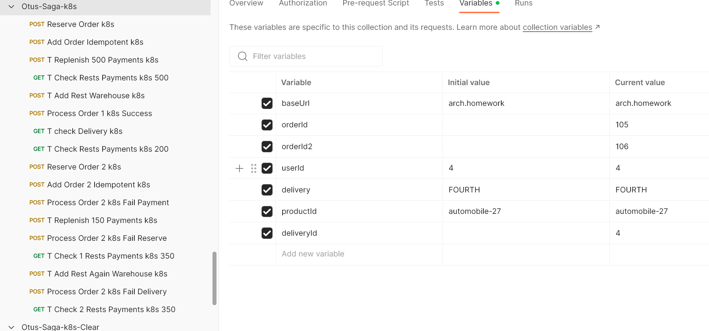

# Otus 08
Распределенные транзакции
# Результат выполнения задания
Студент: Дмитриев С.А. Группа OTUS MicroserviceArchitecture-2023-04

## Описание
Домашнее задание №8 является развитием задания №7.
Дорабатываю уже написанный сервис Заказов (Orders).
Заказ создается идемпотентно в два шага: Резервирование и Создание.

Теперь добавился шаг Обработка.
Целью шага является "Произвести оплату, зарезервировать заказ на складе и зарезервировать курьерскую доставку"
В случае, если на каком-либо из этих шагов в сервис Заказов возвращается ошибка, результаты предыдущих действий  должны быть отменены.
То есть, если не удалось зарезервировать заказ на складе, должен быть осуществлен возврат денег на счет клиента в МС Оплата.
Если не удалось зарезервировать курьерскую доставку, то - возврат денег и аннулирование заказа на складе.
### Использованный паттерн
SAGA - то есть мы совершаем законченные отдельные операции, но при возникновении ошибки предусмотрено выполнение компенсирующих операций.

### Логика работы сервиса
Для этого были созданы 3 микросервиса:
1. Оплата (payments)
2. Склад (warehouse)
3. Доставка (delivery)

Все 4ре микросервиса размещаю в одном namespace (zipper) кубернетеса.
Главный МС Orders торчит наружу через Nginx-Ingress, а 3 вспомогательных (payments, warehouse и delivery) реализованы в виде Service типа NodePort и вызываются сервисом Orders через внутренние адреса кубернетес (payments-service, warehouse-service, delivery-service).
Все 4 сервиса используют для хранения одну общую БД постгрес mydb (разделение на отдельные БД представляется не сложным, но трудозатратным и не влияющим на смысл этой работы).

Для выполнения тестового сценария требуются технические операции (помеченные буквой T). Это операции, которые не могут выполняться через МС Orders и требующие прямого доступа к вспомогательным микросервисам: пополнение денежного счета клиента, пополнение остатков на складе, операции проверки суммы на денежном счете и состояния склада после проведения операции. При необходимости - очистка к начальному состоянию (Коллекция Postman-Saga-k8s-Clear.json). 

### Порядок выполнения тестового сценария
1. Клиент резервирует Id заказа 1 (Reserve Order k8s)
2. Клиент создает заказ 1 на 300 рублей (Add Order Idempotent k8s)
3. Технической операцией(ТО) добавляем клиенту на счет 500 руб (МС Payments) (T Replenish 500 Payments k8s)
4. ТО проверяем что у клиента на счете есть 500 руб (T Check Rests Payments k8s 500)
5. ТО добавляем на склад 1 единицу товара (T Add Rest Warehouse k8s)
6. Успешно обрабатываем заказ 1 (Process Order 1 k8s Success)
7. ТО проверяем, что появилась доставка со статусом SUCCESS в сервисе Delivery (T Check Delivery k8s)
8. ТО проверяем, что у клиенты на счете осталось 200 руб (T Check Rest Payments k8s 200)
9. Резервируем Id заказа 2 (Reserve Order 2 k8s)
10. Создаем заказ 2 на 290 руб (Add order 2 Idempotent k8s)
11. Обрабатываем заказ 2 с ошибкой "Недостаточно денег" (Process Order 2 k8s Fail Payment)
12. ТО Добавляем клиенту 150 руб (T Replenish 150 Payments k8s)
13. Обрабатываем заказ 2 с ошибкой "Нет товара на складе" (Proccess Order 2 k8s Fail Reserve)
14. ТО Проверяем, что у клиента по-прежнему 350 руб на счете. (T Check 1 Rest Payments k8s 350)
15. ТО Добавляем на склад 1 единицу товара. (T Add Rest Again Warehouse k8s)
16. Обрабатываем заказ 2 с ошибкой "Временной слот доставки уже занят" (Process Order 2 k8s Fail Delivery)
17. ТО Проверяем, что у клиента по-прежнему 350 руб на счете (T Check 2 Rests Payments k8s 350)

## Процесс выполнения:
1. Создал неймспейс zipper
```shell
kubectl apply -f kube-manifest/01_namespace_zipper.yaml
```
2. Установил PostgreSql в неймспейс zipper
```shell
helm install postgresql-test oci://registry-1.docker.io/bitnamicharts/postgresql --set auth.database=mydb,auth.postgresPassword=secretpassword -n zipper
```
3. Написал свой сервис сохранения заказов на Java (my-order-worker-service)
4. Создал секрет для доступа приложения к БД
```shell
kubectl create secret generic db-password --from-literal=password='secretpassword'
```
4. Установил приложение с помощью Helm в неймспейс zipper.
```shell
helm install order-worker-local myapp/. -n zipper
```
5. Написал 3 вспомогательных микросервиса Payment, Warehouse и Delivery.
6. Установил их с помощью Helm.
```shell
helm install payments paym-helm/. --atomic
helm install payments wh-helm/. --atomic
helm install delivery dly-helm/. --atomic
```
5. Сделал коллекцию postman для проверки предложенного сценария (Otus-Saga-k8s.json)
Для тестирования сделал проброс порта:
```shell
kubectl port-forward --namespace nginx-ingress svc/ingress-nginx-controller 8080:80 --address 127.0.0.1,192.168.1.191
kubectl port-forward --namespace zipper svc/payments-service 8010:8010 --address 127.0.0.1,192.168.1.191
kubectl port-forward --namespace zipper svc/warehouse-service 8020:8020 --address 127.0.0.1,192.168.1.191
kubectl port-forward --namespace zipper svc/delivery-service 8030:8030 --address 127.0.0.1,192.168.1.191
```
```shell
newman run Otus-Saga-k8s.json --verbose
```


Всё.
